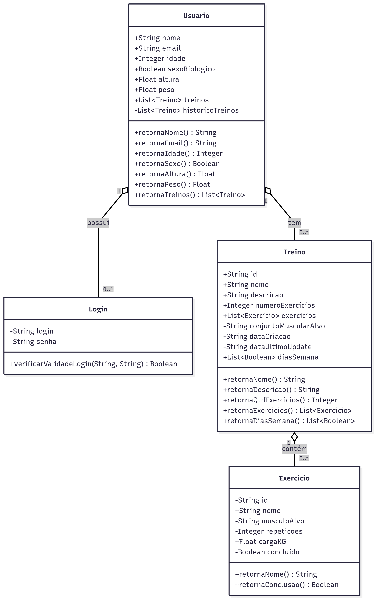

# Documentação do LiftUp

      [ ] Diagrama de classes do domínio do problema;
      [x] Ferramentas escolhidas (Git, build, testes, issue tracking, CI/CD, container);
      [?] Frameworks reutilizados;
      [x] Como gerar a documentação do código (ex.: JavaDoc);
      [x] Como executar o sistema.

# LiftUp [](https://github.com/facebook/react/blob/main/LICENSE)

## Diagrama de classes do domínio
> 

## Ferramentas escolhidas
- **Git & GitHub** – Controle de versão e hospedagem do código. Ideal para colaboração e CI/CD.
- **TypeScript** – Tipagem estática para JavaScript, melhorando manutenção e evitando bugs.
- **ESLint + eslint-config-expo** – Ferramentas de linting para manter a qualidade e padrão do código.
- **Expo CLI** – Utilitário para build, preview e gerenciamento de pacotes.
- **TypeDoc** – Gera documentação automática a partir de comentários no código TypeScript.

## Frameworks reutilizados
- **React Native** – Base do app mobile. Permite desenvolver para Android, iOS e Web com o mesmo código.
- **Expo** – Framework que abstrai a complexidade do React Native puro. Facilita o build, preview e uso de APIs nativas.
- **Expo Router** – Framework de roteamento baseado em arquivos, facilitando a navegação e organização de telas.
- **React Navigation** – Biblioteca de navegação usada por trás do Expo Router. Permite uso de abas (`bottom-tabs`) e navegação declarativa.
- **React** – Biblioteca principal para construção de interfaces com componentes.
- **React Native Gesture Handler** e **Reanimated** – Usadas por baixo para interações fluidas e animações.
- **Expo Modules** – Bibliotecas da família Expo adicionadas por necessidade ou por padrão:
  - `expo-font`, `expo-status-bar`, `expo-haptics`, `expo-image`, `expo-splash-screen`, `expo-web-browser`, etc.
  - A maioria dessas lida com funcionalidades nativas de forma simples (ex: haptics, splash, web browser).

## Como gerar a documentação do código
O projeto utiliza [TypeDoc](https://typedoc.org/) para gerar documentação automática a partir do código TypeScript.

1. Instale a dependência

   ```bash
      npm install --save-dev typedoc
   ```

2. Gere a documentação do código
   ```bash
      npm run docs
   ```

A documentação será gerada na pasta `docs/`, podendo ser visualizada ao abrir o arquivo `docs/index.html`.

## Como executar

### Pré-requisitos
- Docker e Docker Compose instalados
- Node.js 18+ instalado
- Expo CLI instalado (`npm install -g @expo/cli`)

### Estrutura do Projeto
```
liftup/
├── app/                    # Frontend React Native (Expo)
├── backend/               # API Node.js + Express
│   ├── src/
│   │   ├── routes/        # Rotas da API
│   │   ├── middleware/    # Middlewares
│   │   ├── lib/          # Bibliotecas (Prisma)
│   │   └── test/         # Testes
│   ├── prisma/           # Schema e migrações do banco
│   └── package.json
├── services/             # Serviços do frontend
├── scripts/              # Scripts de automação
├── docs/                 # Documentação
├── docker-compose.yml    # Containers de desenvolvimento
└── docker-compose.prod.yml # Containers de produção
```

### Setup inicial (primeira vez)

1. Clone o repositório
   ```bash
   git clone https://github.com/pedromendonca2/liftup.git
   cd liftup/
   ```

2. Execute o script de setup

   **Linux/Mac:**
   ```bash
   chmod +x scripts/setup.sh
   ./scripts/setup.sh
   ```

   **Windows:**
   ```cmd
   scripts\setup.bat
   ```

   Este script irá:
   - Iniciar PostgreSQL com Docker
   - Configurar o banco de dados
   - Instalar dependências do backend
   - Executar migrações do Prisma
   - Popular o banco com dados iniciais

### Execução diária

Para iniciar todo o ambiente de desenvolvimento:

**Linux/Mac:**
```bash
chmod +x scripts/start.sh
./scripts/start.sh
```

**Windows:**
```cmd
scripts\start.bat
```

Ou manualmente:

1. Iniciar containers
   ```bash
   docker-compose up -d
   ```

2. Iniciar backend
   ```bash
   cd backend
   npm run dev
   ```

3. Em outro terminal, instalar dependências do frontend (se necessário)
   ```bash
   npm install
   ```

4. Iniciar frontend
   ```bash
   npx expo start
   ```

   Se estiver utilizando WSL, use tunelamento:
   ```bash
   npx expo start --tunnel
   ```

### URLs e credenciais

- **Backend API**: http://localhost:3001
- **PgAdmin**: http://localhost:8080
  - Email: admin@liftup.com
  - Senha: admin123
- **PostgreSQL**: localhost:5432

### Credenciais de teste
- **Email**: admin@liftup.com
- **Senha**: admin123

### Comandos úteis

```bash
# Parar containers
docker-compose down

# Ver logs do PostgreSQL
docker-compose logs postgres

# Acessar banco via CLI
docker-compose exec postgres psql -U liftup_user -d liftup

# Resetar banco
cd backend
npx prisma db push --force-reset
npm run db:seed

# Executar testes
cd backend
npm test

# Verificar linting
cd backend
npm run lint

# Gerar documentação da API
cd backend
npx prisma studio

# Produção
docker-compose -f docker-compose.prod.yml up -d
```

### Desenvolvimento

#### Backend
```bash
cd backend
npm run dev          # Desenvolvimento com hot reload
npm test            # Executar testes
npm run lint        # Verificar código
npm run db:studio   # Interface visual do banco
```

#### Frontend
```bash
npm install         # Instalar dependências
npx expo start      # Iniciar servidor de desenvolvimento
npx expo start --tunnel  # Com tunelamento (WSL)
```

### Produção

Para deploy em produção:

```bash
# Usando Docker Compose
docker-compose -f docker-compose.prod.yml up -d

# Ou usando PM2
cd backend
npm install -g pm2
pm2 start ecosystem.config.js --env production
```

### Monitoramento

- **Health Check**: http://localhost:3001/api/health
- **PgAdmin**: http://localhost:8080
- **Prisma Studio**: `cd backend && npx prisma studio`

### Comandos Make

Para facilitar o desenvolvimento, use os comandos do Makefile:

```bash
make help          # Mostra todos os comandos disponíveis
make setup         # Configura o ambiente inicial
make start         # Inicia o ambiente de desenvolvimento
make stop          # Para o ambiente
make clean         # Limpa containers e volumes
make test          # Executa testes
make lint          # Executa linting
make build         # Constrói imagens Docker
make deploy        # Deploy em produção
make logs          # Mostra logs dos containers
make reset-db      # Reseta o banco de dados
make studio        # Abre Prisma Studio
```

### Estrutura de Arquivos

```
liftup/
├── app/                    # Frontend React Native (Expo)
├── backend/               # API Node.js + Express
│   ├── src/
│   │   ├── routes/        # Rotas da API
│   │   ├── middleware/    # Middlewares
│   │   ├── lib/          # Bibliotecas (Prisma)
│   │   └── test/         # Testes
│   ├── prisma/           # Schema e migrações do banco
│   └── package.json
├── services/             # Serviços do frontend
├── scripts/              # Scripts de automação
├── docs/                 # Documentação
├── docker-compose.yml    # Containers de desenvolvimento
├── docker-compose.prod.yml # Containers de produção
├── Makefile              # Comandos de automação
└── README.md
```

### Tecnologias Utilizadas

#### Backend
- **Node.js** + **Express** - Servidor API
- **PostgreSQL** - Banco de dados
- **Prisma** - ORM
- **JWT** - Autenticação
- **bcryptjs** - Hash de senhas
- **Jest** - Testes
- **ESLint** - Linting
- **Docker** - Containerização

#### Frontend
- **React Native** - Framework mobile
- **Expo** - Plataforma de desenvolvimento
- **TypeScript** - Tipagem estática
- **AsyncStorage** - Armazenamento local
- **React Navigation** - Navegação

#### DevOps
- **Docker Compose** - Orquestração de containers
- **GitHub Actions** - CI/CD
- **Nginx** - Proxy reverso (produção)
- **PM2** - Gerenciamento de processos (produção)

## Licença

LiftUp é licenciado por [MIT LICENSE](./LICENSE).
